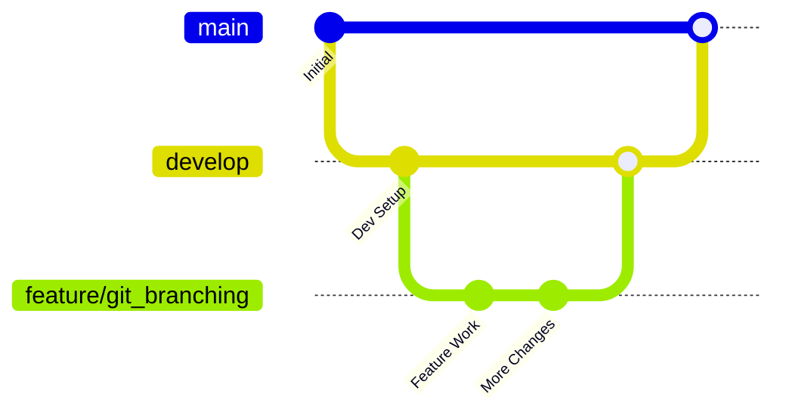
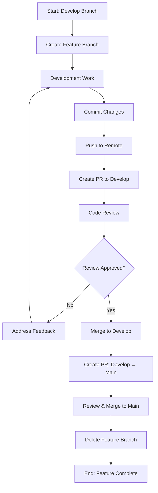
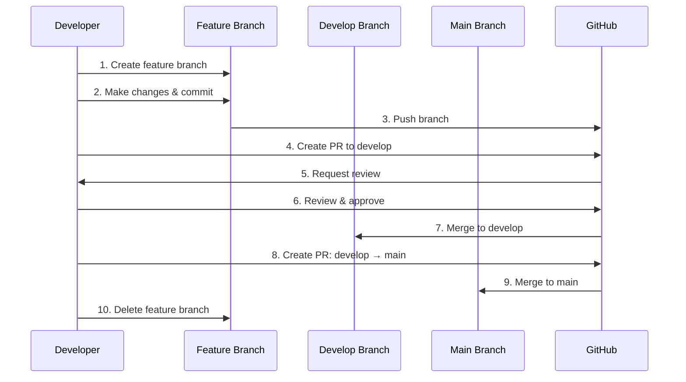

# Git Branching Workflow Guide

## Overview
This document outlines the complete Git branching workflow for the Dedalus BI Dashboard project, following industry best practices for collaborative development.

## Branch Structure



## Workflow Steps

### 1. Create Feature Branch

```bash
# Switch to develop branch
git checkout develop

# Pull latest changes
git pull origin develop

# Create new feature branch
git checkout -b feature/branch-name

# Push to remote
git push -u origin feature/branch-name
```

### 2. Development Work

```bash
# Make changes to files
# Add and commit changes
git add .
git commit -m "feat: descriptive commit message"

# Push changes
git push origin feature/branch-name
```

### 3. Create Pull Request to Develop

```bash
# Using GitHub CLI
gh pr create --base develop --head feature/branch-name \
  --title "Feature: Description" \
  --body "Detailed description of changes"
```

### 4. Code Review Process

```bash
# Request review (via GitHub UI or CLI)
gh pr review PR_NUMBER --request-changes --body "Review comments"

# Or approve
gh pr review PR_NUMBER --approve --body "LGTM"
```

### 5. Merge to Develop

```bash
# Merge pull request
gh pr merge PR_NUMBER --merge

# Switch to develop and pull
git checkout develop
git pull origin develop
```

### 6. Release to Main

```bash
# Create release PR from develop to main
gh pr create --base main --head develop \
  --title "Release: Version description" \
  --body "Release notes and changes"

# Merge to main
gh pr merge PR_NUMBER --merge
```

### 7. Cleanup Feature Branch

```bash
# Delete local branch
git branch -d feature/branch-name

# Delete remote branch
git push origin --delete feature/branch-name
```

## Visual Workflow



## Detailed Process Flow



## Command Reference

### Essential Git Commands

| Command | Purpose |
|---------|---------|
| `git checkout -b feature/name` | Create new feature branch |
| `git add .` | Stage all changes |
| `git commit -m "message"` | Commit with message |
| `git push origin branch-name` | Push to remote |
| `git pull origin develop` | Pull latest develop |
| `git branch -d branch-name` | Delete local branch |
| `git push origin --delete branch-name` | Delete remote branch |

### GitHub CLI Commands

| Command | Purpose |
|---------|---------|
| `gh pr create` | Create pull request |
| `gh pr review` | Review pull request |
| `gh pr merge` | Merge pull request |
| `gh pr list` | List pull requests |
| `gh pr view` | View PR details |

## Branch Naming Conventions

### Feature Branches
- `feature/feature-name` - New features
- `bugfix/issue-description` - Bug fixes
- `hotfix/critical-fix` - Critical production fixes
- `docs/documentation-update` - Documentation changes

### Examples
```bash
feature/user-authentication
bugfix/chart-rendering-issue
hotfix/security-vulnerability
docs/api-documentation
```

## Commit Message Format

```
type(scope): description

[optional body]

[optional footer]
```

### Types
- `feat`: New feature
- `fix`: Bug fix
- `docs`: Documentation
- `style`: Formatting changes
- `refactor`: Code refactoring
- `test`: Adding tests
- `chore`: Maintenance tasks

### Examples
```bash
feat(auth): add user login functionality
fix(charts): resolve pie chart rendering issue
docs(readme): update installation instructions
```

## Best Practices

### 1. Branch Management
- Always create feature branches from `develop`
- Keep feature branches focused and small
- Regularly sync with `develop` to avoid conflicts
- Delete branches after merging

### 2. Pull Requests
- Write descriptive PR titles and descriptions
- Include screenshots for UI changes
- Link related issues
- Request appropriate reviewers

### 3. Code Review
- Review code thoroughly
- Provide constructive feedback
- Test changes locally when possible
- Approve only when confident

### 4. Merging Strategy
- Use merge commits for feature branches
- Squash commits for small fixes
- Never force push to shared branches
- Always test before merging to main

## Troubleshooting

### Common Issues

#### Merge Conflicts
```bash
# Pull latest develop
git checkout develop
git pull origin develop

# Rebase feature branch
git checkout feature/branch-name
git rebase develop

# Resolve conflicts and continue
git add .
git rebase --continue
```

#### Accidental Commits to Wrong Branch
```bash
# Move commits to correct branch
git checkout correct-branch
git cherry-pick commit-hash

# Remove from wrong branch
git checkout wrong-branch
git reset --hard HEAD~1
```

#### Sync Fork with Upstream
```bash
# Add upstream remote
git remote add upstream https://github.com/original/repo.git

# Fetch and merge
git fetch upstream
git checkout main
git merge upstream/main
```

## Automation Scripts

### Quick Feature Branch Creation
```bash
#!/bin/bash
# create-feature.sh
BRANCH_NAME=$1
git checkout develop
git pull origin develop
git checkout -b feature/$BRANCH_NAME
git push -u origin feature/$BRANCH_NAME
echo "Feature branch feature/$BRANCH_NAME created and pushed"
```

### Cleanup Merged Branches
```bash
#!/bin/bash
# cleanup-branches.sh
git checkout develop
git branch --merged | grep -v "\*\|main\|develop" | xargs -n 1 git branch -d
git remote prune origin
echo "Cleaned up merged branches"
```

## Integration with CI/CD

### GitHub Actions Workflow
```yaml
name: Feature Branch CI
on:
  pull_request:
    branches: [develop]
jobs:
  test:
    runs-on: ubuntu-latest
    steps:
      - uses: actions/checkout@v3
      - name: Setup Python
        uses: actions/setup-python@v4
        with:
          python-version: '3.11'
      - name: Install dependencies
        run: pip install -r requirements.txt
      - name: Run tests
        run: python -m pytest
```

## Team Guidelines

### For Developers
1. Always work on feature branches
2. Write clear commit messages
3. Keep PRs small and focused
4. Test changes before pushing
5. Respond to review feedback promptly

### For Reviewers
1. Review within 24 hours
2. Provide constructive feedback
3. Test critical changes
4. Approve only when confident
5. Use GitHub's review tools

### For Maintainers
1. Protect main and develop branches
2. Require PR reviews
3. Run automated tests
4. Maintain clean history
5. Document release processes

---

**Git Workflow Guide** - Dedalus BI Dashboard Team Collaboration
